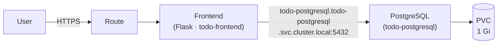
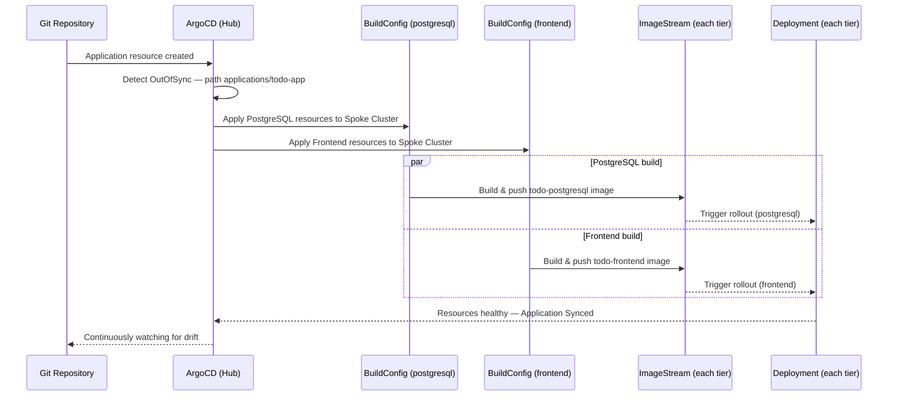

# Deploy a 2-Tier Example Application

In this scenario you will deploy **Sweep Dreams** — a 2-tier web application consisting of a **Flask frontend** and a **PostgreSQL backend**. The two tiers run in separate namespaces and communicate over the cluster's internal DNS.

You will deploy the application **twice**, using two different approaches:

1. **Part 1 — OpenShift CLI:** deploy directly from the web terminal with a single `oc apply -k` command.
2. **Part 2 — ArgoCD Application:** deploy the same app as a GitOps Application, letting ArgoCD continuously sync the desired state from Git.

---

## What you will learn

- How a 2-tier application is structured across multiple namespaces
- How inter-service communication works via OpenShift cluster DNS
- How Kustomize manages multiple related components in one apply
- How on-cluster builds work for both tiers simultaneously
- How to deploy an application as an ArgoCD GitOps Application
- The difference between a direct CLI deploy and a GitOps-managed deploy

---

## Prerequisites

| Requirement | Details |
|---|---|
| OpenShift Web Console access | Log in with your workshop credentials |
| Assigned cluster | Use your Spoke cluster |
| Internet access from the cluster | Required to pull base images during build |

---

## Application overview

Sweep Dreams is a todo / chore tracker. The frontend serves a single-page UI and exposes a REST API. All tasks are persisted in PostgreSQL.



| Tier | Namespace | Key resources |
|---|---|---|
| PostgreSQL | `todo-postgresql` | Secret, PVC, ImageStream, BuildConfig, Deployment, Service |
| Frontend | `todo-frontend` | ConfigMap, Secret, ImageStream, BuildConfig, Deployment, Service, Route |

---

## Part 1 — OpenShift CLI

### Step 1 — Open the web terminal

1. In the top-right toolbar of the Web Console, click the **Command Line** icon ( `>_` ).
2. A terminal panel opens at the bottom of the screen. Wait a moment for it to initialise.

---

### Step 2 — Deploy the application

Run the following commands one by one:

**Clone the repository:**
```bash
git clone https://github.com/Caseraw/OpenShiftQuickStarts.git
```

**Change into the application directory:**
```bash
cd OpenShiftQuickStarts/applications/todo-app/
```

**Apply all manifests with Kustomize:**
```bash
oc apply -k .
```

You should see output similar to:

```
namespace/todo-postgresql created
namespace/todo-frontend created
secret/todo-postgresql created
secret/todo-frontend created
configmap/todo-frontend created
service/todo-postgresql created
service/todo-frontend created
persistentvolumeclaim/todo-postgresql created
deployment.apps/todo-postgresql created
deployment.apps/todo-frontend created
buildconfig.build.openshift.io/todo-postgresql created
buildconfig.build.openshift.io/todo-frontend created
imagestream.image.openshift.io/todo-postgresql created
imagestream.image.openshift.io/todo-frontend created
route.route.openshift.io/todo-frontend created
```

!!! info "What does `oc apply -k .` do here?"
    Kustomize reads the top-level `kustomization.yaml`, which references both the `kustomize/postgresql` and `kustomize/frontend` directories. All resources across both namespaces are applied in a single operation.

---

### Step 3 — Monitor the builds

Both tiers trigger an on-cluster Docker build immediately. To follow the logs:

```bash
oc logs -n todo-postgresql build/todo-postgresql-1 -f
```

```bash
oc logs -n todo-frontend build/todo-frontend-1 -f
```

!!! info "Build duration"
    Each build takes **2–5 minutes**. Both run in parallel.

---

### Step 4 — Wait for the deployments

```bash
oc rollout status deployment/todo-postgresql -n todo-postgresql
oc rollout status deployment/todo-frontend -n todo-frontend
```

---

### Step 5 — Access the application

```bash
oc get route todo-frontend -n todo-frontend -o jsonpath='{.spec.host}'
```

Open the URL in your browser. You should see the **Sweep Dreams** todo list pre-loaded with five sample tasks. Try adding, completing, and deleting tasks to confirm end-to-end connectivity with PostgreSQL.

!!! success "Part 1 complete"
    You have deployed a 2-tier application across two namespaces using the CLI. Continue to Part 2 to deploy the same application using ArgoCD.

---

### Clean up — Delete the application

Before continuing to Part 2, remove the application by deleting both namespaces:

```bash
oc delete namespace todo-frontend todo-postgresql
```

!!! warning "Required before continuing"
    Part 2 will recreate the same namespaces. Deleting them first avoids resource conflicts.

---

## Part 2 — ArgoCD Application

In this part you will deploy the same application as an ArgoCD **Application** resource. ArgoCD continuously watches the Git repository and keeps the cluster in sync with the desired state defined there.

### Step 1 — Review the Application manifests

The todo-app is split into two separate ArgoCD Applications — one per tier — each pointing to its own Kustomize directory. Both manifests live in a single file in the repository.

Review the file on GitHub before applying it:

:material-github: [applications/todo-app/argocd/application.yaml](https://github.com/Caseraw/OpenShiftQuickStarts/blob/main/applications/todo-app/argocd/application.yaml)

The file contains two `Application` resources. Key fields to note in each:

```yaml
# PostgreSQL tier
spec:
  source:
    path: applications/todo-app/kustomize/postgresql
  destination:
    server: https://kubernetes.default.svc   # in-cluster — applied on the Spoke directly
    namespace: todo-postgresql

# Frontend tier
spec:
  source:
    path: applications/todo-app/kustomize/frontend
  destination:
    server: https://kubernetes.default.svc
    namespace: todo-frontend
```

Both Applications share the same `syncPolicy`:

```yaml
syncPolicy:
  automated:
    prune: true     # removes resources deleted from Git
    selfHeal: true  # reverts manual changes to match Git
```

!!! info "Why two Applications instead of one?"
    Each tier is an independent deployable unit with its own namespace, lifecycle, and health status. Splitting them gives ArgoCD a clearer view of each tier's sync and health state, and allows rolling out changes to one tier without touching the other.

!!! info "How this differs from Part 1"
    In Part 1 you ran `oc apply -k .` once — a one-shot imperative deploy.
    Here ArgoCD watches the Git repository continuously. If you change a manifest in Git, ArgoCD detects the drift and reconciles the cluster automatically. If you manually change a resource on the cluster, `selfHeal` reverts it back to the Git state.

---

### Step 2 — Apply the Application manifests

The manifests use `https://kubernetes.default.svc` as the destination server, so they must be applied **on the Spoke cluster where the app will run** — not on the Hub.

In the web terminal (make sure you are logged into your Spoke cluster):

**If you do not have the repository cloned yet:**
```bash
git clone https://github.com/Caseraw/OpenShiftQuickStarts.git
cd OpenShiftQuickStarts
```

**Apply both ArgoCD Applications:**
```bash
oc apply -f applications/todo-app/argocd/application.yaml
```

You should see:

```
application.argoproj.io/todo-app-postgresql created
application.argoproj.io/todo-app-frontend created
```

---

### Step 3 — Watch ArgoCD sync the application

ArgoCD will immediately start syncing the `applications/todo-app` path to the cluster.

1. Open the **ArgoCD UI** — retrieve the URL with:
   ```bash
   oc get route openshift-gitops-server -n openshift-gitops -o jsonpath='{.spec.host}'
   ```
2. Log in and find the **todo-app-postgresql** and **todo-app-frontend** Application tiles.
3. Watch each status progress from `OutOfSync` → `Syncing` → `Synced`.
4. Click a tile to open the Application graph and see all resources being created for that tier.

Both on-cluster builds will start automatically as soon as the BuildConfigs are applied by ArgoCD. The Deployments roll out once the builds complete, just as in Part 1.

---

### Step 4 — Access the application

Retrieve the Route from the cluster:

```bash
oc get route todo-frontend -n todo-frontend -o jsonpath='{.spec.host}'
```

Open the URL in your browser and verify the application is working.

!!! success "Scenario complete"
    You have deployed the same 2-tier application using two approaches — direct CLI and GitOps via ArgoCD. The end result is identical, but ArgoCD continuously enforces the desired state from Git, turning your repository into the single source of truth for the cluster.

---

## What happened under the hood



---

## Clean up (optional)

To remove both ArgoCD Applications and all resources they manage:

```bash
oc delete application todo-app-postgresql todo-app-frontend -n openshift-gitops
```

ArgoCD will prune all resources it created (both namespaces and everything inside them) before removing the Application objects.
