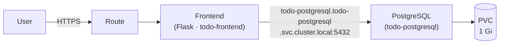
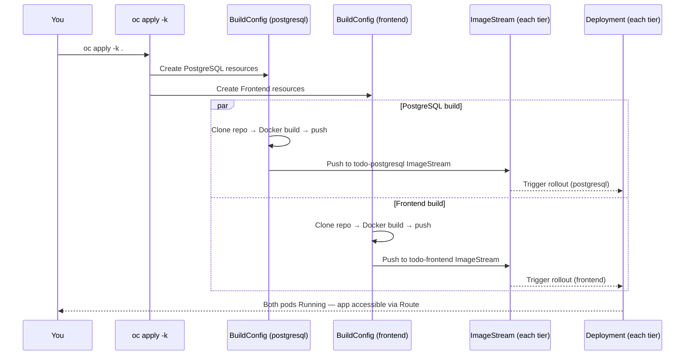

# Deploy a 2-Tier Example Application

In this scenario you will deploy **Sweep Dreams** — a 2-tier web application consisting of a **Flask frontend** and a **PostgreSQL backend**. The two tiers run in separate namespaces and communicate over the cluster's internal DNS, which is the standard pattern for multi-component applications on OpenShift.

You will deploy the entire application with a single command from the OpenShift web terminal.

---

## What you will learn

- How a 2-tier application is structured across multiple namespaces
- How inter-service communication works via OpenShift cluster DNS
- How Kustomize manages multiple related components in one apply
- How on-cluster builds work for both tiers simultaneously
- How to monitor builds and deployments for a multi-component application

---

## Prerequisites

| Requirement | Details |
|---|---|
| OpenShift Web Console access | Log in with your workshop credentials |
| Assigned cluster | Use your Spoke cluster |
| Internet access from the cluster | Required to pull base images during build |

---

## Application overview

Sweep Dreams is a todo / chore tracker. The frontend serves a single-page UI and exposes a REST API. All tasks are persisted in PostgreSQL.



| Tier | Namespace | Key resources |
|---|---|---|
| PostgreSQL | `todo-postgresql` | Secret, PVC, ImageStream, BuildConfig, Deployment, Service |
| Frontend | `todo-frontend` | ConfigMap, Secret, ImageStream, BuildConfig, Deployment, Service, Route |

---

## Step 1 — Open the web terminal

1. In the top-right toolbar of the Web Console, click the **Command Line** icon ( `>_` ).
2. A terminal panel opens at the bottom of the screen. Wait a moment for it to initialise.

---

## Step 2 — Deploy the application

Run the following commands one by one in the terminal:

**Clone the repository:**
```bash
git clone https://github.com/Caseraw/OpenShiftQuickStarts.git
```

**Change into the application directory:**
```bash
cd OpenShiftQuickStarts/applications/todo-app/
```

**Apply all manifests with Kustomize:**
```bash
oc apply -k .
```

You should see output similar to:

```
namespace/todo-postgresql created
namespace/todo-frontend created
secret/todo-postgresql created
secret/todo-frontend created
configmap/todo-frontend created
service/todo-postgresql created
service/todo-frontend created
persistentvolumeclaim/todo-postgresql created
deployment.apps/todo-postgresql created
deployment.apps/todo-frontend created
buildconfig.build.openshift.io/todo-postgresql created
buildconfig.build.openshift.io/todo-frontend created
imagestream.image.openshift.io/todo-postgresql created
imagestream.image.openshift.io/todo-frontend created
route.route.openshift.io/todo-frontend created
```

!!! info "What does `oc apply -k .` do here?"
    Kustomize reads the top-level `kustomization.yaml`, which references both the `kustomize/postgresql` and `kustomize/frontend` directories. All 15 resources across both namespaces are applied in a single operation — no manual ordering or looping required.

---

## Step 3 — Monitor the builds

Both tiers trigger an on-cluster Docker build immediately after their BuildConfig is created. The builds run in parallel.

1. Switch to the **Core platform** perspective.
2. Open **Workloads** / **Topology** in the left navigation bar.
3. Use the **Project** dropdown to select `todo-postgresql`. You will see the PostgreSQL build running.
4. Switch the project to `todo-frontend` to see the frontend build.

To watch build logs for each tier:

```bash
oc logs -n todo-postgresql build/todo-postgresql-1 -f
```

```bash
oc logs -n todo-frontend build/todo-frontend-1 -f
```

!!! info "Build duration"
    Each build takes **2–5 minutes**. The PostgreSQL image installs the init scripts; the frontend installs Python dependencies via pip.

---

## Step 4 — Wait for the deployments

Once each build completes, the ImageStream trigger fires and the Deployment rolls out automatically.

Check the pod status for both tiers:

```bash
oc get pods -n todo-postgresql
oc get pods -n todo-frontend
```

Wait until both show `1/1 Running`:

```
NAME                              READY   STATUS    RESTARTS   AGE
todo-postgresql-xxx               1/1     Running   0          2m

NAME                          READY   STATUS    RESTARTS   AGE
todo-frontend-xxx             1/1     Running   0          1m
```

You can also watch the rollout directly:

```bash
oc rollout status deployment/todo-postgresql -n todo-postgresql
oc rollout status deployment/todo-frontend -n todo-frontend
```

---

## Step 5 — Access the application

Retrieve the Route URL:

```bash
oc get route todo-frontend -n todo-frontend -o jsonpath='{.spec.host}'
```

Open the URL in your browser (it will be an `https://` address). You should see the **Sweep Dreams** todo list pre-loaded with five sample tasks.

Try the following actions to confirm everything works end to end:

- [x] **Add a task** — type a description and click **Add task**. The item appears in the list and is stored in PostgreSQL.
- [x] **Complete a task** — click the circle checkbox next to any item. It turns green and the title gets a strikethrough.
- [x] **Delete a task** — click the trash icon on the right of any item to remove it permanently.

!!! success "Scenario complete"
    You have deployed a 2-tier application across two namespaces, built both images on-cluster, and verified end-to-end connectivity between the frontend and the PostgreSQL database.

---

## What happened under the hood



---

## Clean up (optional)

To remove the application, delete both namespaces:

```bash
oc delete namespace todo-frontend todo-postgresql
```

This removes all resources in both namespaces including the PVC and its data.
