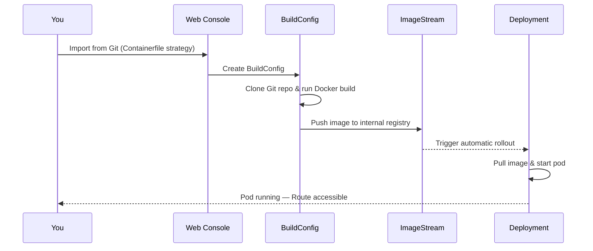

# Deploy an Example Application

In this scenario you will deploy **hello-openshift** — a single-container web application that displays basic information about the pod it is running in. You will use the OpenShift Web Console to import the source code directly from Git, trigger an on-cluster Docker build, and expose the application via a Route.

---

## What you will learn

- How to create a new Project from the Web Console
- How to import an application from Git using the **Import from Git** flow
- How OpenShift builds a container image on-cluster using a `Containerfile`
- How to monitor a build and a deployment rollout
- How to access a running application via a Route

---

## Prerequisites

| Requirement | Details |
|---|---|
| OpenShift Web Console access | Log in with your workshop credentials |
| Assigned cluster | Use your Spoke cluster |
| Internet access from the cluster | Required to clone the Git repository |

---

## Step 1 — Create a new Project

1. In the left navigation bar, click **Home → Projects**.
2. Click **Create Project** (top-right corner).
3. Fill in the following fields:

    | Field | Value |
    |---|---|
    | Name | `hello-openshift` |
    | Display name | `Hello OpenShift` |
    | Description | *(leave blank)* |

4. Click **Create**.

!!! tip
    The **Project** is an OpenShift namespace that scopes all resources you create below it.

---

## Step 2 — Import from Git

1. Make sure you are in the **Developer** perspective (use the perspective switcher in the top-left corner if needed).
2. Click the **+** (Add) icon in the top-right toolbar, or use **+Add** in the left navigation bar.
3. Click **Import from Git**.

### Fill in the Git repository details

In the **Git** section, enter:

| Field | Value |
|---|---|
| Git Repo URL | `https://github.com/Caseraw/OpenShiftQuickStarts.git` |

Click **Show advanced Git options** and fill in:

| Field | Value |
|---|---|
| Git reference | `main` |
| Context dir | `applications/hello-openshift/src` |

!!! info "Why a context dir?"
    The repository contains many directories. The **Context dir** tells OpenShift to only use the `applications/hello-openshift/src` subdirectory as the build root, where the `Containerfile` and application source code live.

---

### Verify the build strategy

After entering the repository details, OpenShift will detect the `Containerfile` automatically.

- Confirm **Import strategy** is set to **Dockerfile** (OpenShift's name for a Docker/Containerfile build strategy).

!!! warning
    If the strategy was auto-detected as something else, click the strategy selector and choose **Dockerfile** manually.

---

### Configure general settings

Scroll down to the **General** section:

| Field | Value |
|---|---|
| Application name | `hello-openshift` |
| Name | `hello-openshift` |

Ensure the **Project** dropdown shows `hello-openshift`.

---

### Configure the build and deploy options

Scroll to the **Build** and **Deploy** sections and verify:

- **Build** is set to `BuildConfig`.
- **Deploy** is set to `Deployment`.

---

### Add Downward API environment variables

The application reads pod metadata from environment variables injected by the [Downward API](https://kubernetes.io/docs/concepts/workloads/pods/downward-api/). Without these the app will display `unknown` for all pod fields.

1. Click **Show advanced Deployment options**.
2. Scroll to the **Environment variables (runtime only)** section.
3. Add the following four variables one by one. For each, click **Add value** and then change the **Value** source dropdown to **Field**:

    | Variable name | Field path |
    |---|---|
    | `POD_NAME` | `metadata.name` |
    | `POD_NAMESPACE` | `metadata.namespace` |
    | `NODE_NAME` | `spec.nodeName` |
    | `POD_IP` | `status.podIP` |

!!! tip "How to add a Field variable"
    Click **Add value** → next to the new row, open the dropdown that says **Value** and switch it to **Field** → type the field path in the path input that appears.

---

### Configure networking

Scroll to the **Advanced options** section:

- Confirm **Target port** is set to `8080`.
- Confirm the **Create a route to the Application** checkbox is **enabled**.

---

### Create the application

Click **Create** at the bottom of the form.

OpenShift will now:

1. Create the Project resources (ImageStream, BuildConfig, Deployment, Service, Route).
2. Clone the Git repository and start an on-cluster Docker build.
3. Push the resulting image to the internal registry.
4. Roll out the Deployment once the image is available.

---

## Step 3 — Monitor the build and deployment

You will land on the **Topology** view. Find the `hello-openshift` application node.

### Check the build

1. Click the application node to open the side panel.
2. Click the **Resources** tab.
3. Under **Builds**, you will see `hello-openshift-1` with status **Running**.
4. Click **View logs** to follow the build output in real time.

    The build clones the repository, runs `pip install`, and builds the container image from the `Containerfile`. A successful build ends with:

    ```
    Successfully pushed image-registry.openshift-image-registry.svc:5000/hello-openshift/hello-openshift:latest
    Push successful
    ```

!!! info "Build duration"
    The first build typically takes **2–4 minutes** while pip resolves and installs Python dependencies.

### Wait for the Deployment to become healthy

Once the build completes, the ImageStream triggers an automatic rollout.

1. In the **Resources** tab, look under **Pods**.
2. Wait until the pod status changes to **Running** with `1/1` containers ready.
3. The ring around the application node in Topology turns **solid blue** when the deployment is healthy.

---

## Step 4 — Access the application

1. In the **Topology** view, click the **open URL** arrow icon (↗) on the top-right corner of the `hello-openshift` node. This opens the Route URL in a new browser tab.

    Alternatively, in the side panel click **Resources → Routes → hello-openshift** to copy or open the URL.

2. You should see the **Hello OpenShift** page displaying live pod information:

    | Field | Expected value |
    |---|---|
    | Pod Name | `hello-openshift-<hash>` |
    | Namespace | `hello-openshift` |
    | Node | The cluster node the pod is scheduled on |
    | Pod IP | An in-cluster IP address |

!!! success "Scenario complete"
    You have successfully built and deployed a containerised application on OpenShift entirely from source code, with zero local tooling required.

---

## What happened under the hood



---

## Clean up (optional)

To remove everything created in this scenario, delete the Project:

1. Go to **Home → Projects**.
2. Find `hello-openshift`, click the three-dot menu (**⋮**) on the right.
3. Click **Delete Project** and confirm by typing the project name.

This removes the Namespace and all resources inside it.
