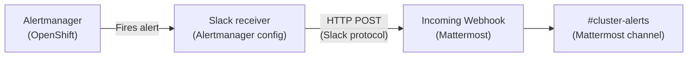

# Deploy Mattermost & Integrate with Alertmanager

In this scenario you will deploy **Mattermost** — an open-source team messaging platform — from the OpenShift Software Catalog using a Helm Chart. Once it is running you will set it up as a chat workspace and then wire it to the cluster's **Alertmanager** so that firing alerts are delivered to a dedicated channel. This is the foundation of **ChatOps**: your cluster tells you when something is wrong, right inside your chat tool.

---

## What you will learn

- How to deploy a Helm-based application from the OpenShift Software Catalog
- How to perform the initial setup of a Mattermost workspace
- How to create an Incoming Webhook in Mattermost
- How to configure Alertmanager receivers and routes in the OpenShift Web Console
- How to test an incoming webhook from the command line

---

## Prerequisites

| Requirement | Details |
|---|---|
| OpenShift Web Console access | Log in with your workshop credentials |
| Assigned cluster | Use your Spoke cluster |
| Cluster admin rights | Required to modify Alertmanager configuration |

---

## Part 1 — Deploy Mattermost

### Step 1 — Create a new Project

1. Switch to the **Core Platform** perspective using the perspective switcher in the top-left corner.
2. In the left navigation bar, click **Home → Projects**.
3. Click **Create Project** (top-right corner) and fill in:

    | Field | Value |
    |---|---|
    | Name | `mattermost` |
    | Display name | `Mattermost` |
    | Description | *(leave blank)* |

4. Click **Create**.

---

### Step 2 — Find Mattermost in the Software Catalog

1. In the left navigation bar, click **Ecosystem → Software Catalog**.
2. In the search bar, type `Mattermost`.
3. Click the **Mattermost Team Edition** tile.

A side panel opens describing the software component. It is deployed via a **Helm Chart** maintained in the catalog.

---

### Step 3 — Deploy the Helm Chart

1. Confirm the **Project** dropdown shows `mattermost`.
2. Click **Create**.
3. Accept all default values on the Helm Chart configuration form.
4. Click **Create** to start the deployment.

The view automatically switches to the **Topology** view and you will see the Mattermost pods appear.

---

### Step 4 — Wait for the deployment

Mattermost runs two components: a **frontend/application server** and a **database backend**. Both must reach `Running` status before the application is usable.

Monitor the Topology view until both nodes show a solid blue ring, or run in the web terminal:

!!! info "Startup time"
    First-time deployment typically takes **3–5 minutes** while the database initialises.

---

### Step 5 — Open the Mattermost URL

1. In the Topology view, click the **mattermost-team-edition** Deployment node.
2. In the side panel, click the **Resources** tab.
3. Under **Routes**, click the Route URL to open Mattermost in a new browser tab.
4. Click **View in Browser** if prompted.

---

### Step 6 — First-time setup

Complete the Mattermost initial setup wizard:

1. **Create an admin account:**

    | Field | Value |
    |---|---|
    | Email | `admin@example.com` *(or any address)* |
    | Username | `admin` |
    | Password | Use the same password as your cluster admin user |

2. **Name your organisation** — for example `ACME org`.
3. On the page with additional configuration, click **Skip**.
4. Click **Finish setup**.

The Mattermost workspace loads for the first time.

---

## Part 2 — Set up the Alerting Channel and Webhook

### Step 7 — Create the `cluster-alerts` channel

1. In the left sidebar under **Channels**, click **Add channels → Create new channel**.
2. Fill in:

    | Field | Value |
    |---|---|
    | Channel name | `cluster-alerts` |
    | Channel type | Public *(default)* |

3. Leave all other settings as defaults and click **Create Channel**.

---

### Step 8 — Create an Incoming Webhook

1. Click the **Mattermost menu** icon (nine-dot grid or your team name) in the top-left.
2. Navigate to **Integrations → Incoming Webhooks**.
3. Click **Add Incoming Webhook** and fill in:

    | Field | Value |
    |---|---|
    | Title | `cluster-alerts` |
    | Channel | `cluster-alerts` |

4. Click **Save**.
5. The next page shows the **Webhook URL**. Copy this URL — you will need it in Part 3.
6. Click **Done**.

---

### Step 9 — Test the webhook

Before wiring Alertmanager, verify the webhook works. Open the web terminal in the OpenShift Console and run:

```bash
curl -i -X POST \
  -H 'Content-Type: application/json' \
  -d '{"channel": "cluster-alerts", "text": "🤖 Connection test: webhook is working."}' \
  <YOUR_MATTERMOST_WEBHOOK_URL>
```

Switch back to the Mattermost browser tab and confirm the test message appears in the **cluster-alerts** channel.

!!! success
    If you see the message in Mattermost, the webhook is working correctly.

---

## Part 3 — Configure Alertmanager

### Step 10 — Open the Alertmanager configuration

1. In the OpenShift Web Console, switch to the **Core Platform** perspective.
2. In the left navigation bar, click **Administration → Cluster Settings**.
3. Click the **Configuration** tab.
4. In the search field, type `Alertmanager` and click the **Alertmanager** entry in the results.

---

### Step 11 — Create the default Slack receiver

Alertmanager uses the Slack protocol, which Mattermost is fully compatible with.

1. Click **Create Receiver**.
2. Fill in the receiver form:

    | Field | Value |
    |---|---|
    | Receiver name | `Cluster Alerts` |
    | Receiver type | `Slack` |
    | Slack API URL | *(paste your Mattermost webhook URL)* |
    | Save as default Slack API URL | ✅ enabled |
    | Channel | `cluster-alerts` |

3. Click **Advanced configuration** to expand extra fields.
4. Enable the **Send resolved alerts to this receiver** checkbox.
5. Scroll down and click **Create**.

---

### Step 12 — Configure the Critical alert route

1. Back on the Alertmanager configuration page, find the **Critical** alert row and click its **Configure** link.
2. Fill in:

    | Field | Value |
    |---|---|
    | Receiver type | `Slack` |
    | Channel | `cluster-alerts` |

3. Click **Advanced configuration**.
4. Enable **Send resolved alerts to this receiver**.
5. Click **Create**.

---

### Step 13 — Configure the Default alert route

Repeat the same steps for the **Default** route:

1. Find the **Default** alert row and click **Configure**.
2. Set:

    | Field | Value |
    |---|---|
    | Receiver type | `Slack` |
    | Channel | `cluster-alerts` |

3. Click **Advanced configuration**.
4. Enable **Send resolved alerts to this receiver**.
5. Click **Create**.

---

## Part 4 — Verify alerts in Mattermost

### Step 14 — Check the channel

Go back to the **Mattermost** browser tab and open the **cluster-alerts** channel.

If there are any active alerts on the cluster, Alertmanager will deliver them to the channel within a minute. Each message will show the alert name, severity, and a description.

### Step 15 — Send a test message

If no alerts are currently firing, you can verify the integration is working end-to-end by sending a test message directly from the web terminal:

```bash
curl -i -X POST \
  -H 'Content-Type: application/json' \
  -d '{"channel": "cluster-alerts", "text": "🤖 Connection test: Bash script can successfully post to this channel."}' \
  <YOUR_MATTERMOST_WEBHOOK_URL>
```

A successful response returns `HTTP/1.1 200 OK` and the message appears in the channel instantly.

!!! success "Scenario complete"
    You have deployed Mattermost, configured a dedicated alerting channel, created an incoming webhook, and wired OpenShift Alertmanager to deliver Critical and Default alerts directly into your chat workspace. Your cluster now talks to you.

---

## What happened under the hood



Mattermost exposes an **Incoming Webhook** that accepts the same JSON payload format as Slack. Alertmanager's built-in Slack receiver posts to this URL whenever an alert fires or resolves, which means no custom integration code is needed.

---

## Clean up (optional)

To remove Mattermost, delete the Project:

1. Go to **Home → Projects**.
2. Find `mattermost`, click the three-dot menu (**⋮**), and click **Delete Project**.
3. Confirm by typing `mattermost`.

To remove the Alertmanager receiver, go back to **Administration → Cluster Settings → Configuration → Alertmanager** and delete the `Cluster Alerts` receiver and its associated routes.
