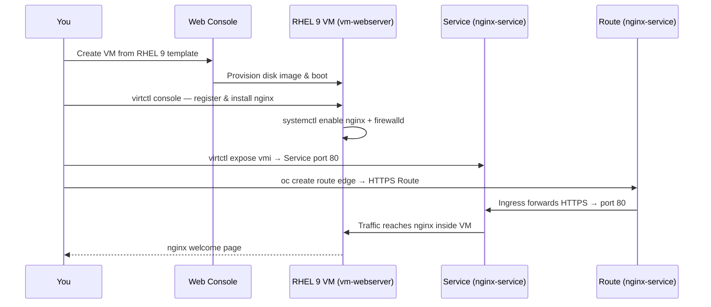

# Deploy a Virtual Machine

In this scenario you will create a **Red Hat Enterprise Linux 9** Virtual Machine using OpenShift Virtualization, explore the VM management interface, install the **nginx** web server inside the VM, and expose it externally via an OpenShift Service and Route.

---

## What you will learn

- How to navigate the Virtualization perspective in the OpenShift Web Console
- How to create a VM from the Template Catalog
- How to explore the VM management tabs (Overview, Metrics, Console, Configuration, and more)
- How to connect to a VM console and run commands inside it
- How to install and start a web server inside a VM
- How to expose a VM workload via a Service and Route

---

## Prerequisites

| Requirement | Details |
|---|---|
| OpenShift Web Console access | Log in with your workshop credentials |
| Assigned cluster | Use your Spoke cluster (OpenShift Virtualization is installed on Spokes only) |
| OpenShift Virtualization | Must be installed and the `HyperConverged` CR ready |

---

## Part 1 — Create the Virtual Machine

### Step 1 — Create a new Project

1. In the top-left corner, make sure you are in the **Core Platform** perspective.
2. In the left navigation bar, click **Home → Projects**.
3. Click **Create Project** (top-right corner).
4. Fill in the following fields:

    | Field | Value |
    |---|---|
    | Name | `vm-app` |
    | Display name | `VM App` |
    | Description | *(leave blank)* |

5. Click **Create**.

---

### Step 2 — Switch to the Virtualization perspective

1. In the top-left corner, click the **perspective switcher** (shows the current perspective name).
2. Select **Virtualization** from the dropdown.

The left navigation bar will update to show Virtualization-specific menu items.

---

### Step 3 — Open the Template Catalog

1. In the left navigation bar, click **Catalog**.
2. Confirm the **Project** dropdown at the top shows `vm-app`. If not, switch to it.
3. In the main view, click the **Template catalog** tab.

You will see a grid of pre-defined VM templates provided by Red Hat.

---

### Step 4 — Choose the RHEL 9 template

1. Find the **Red Hat Enterprise Linux 9 VM** tile and click it.

    !!! tip
        Use the search bar or filter by **Operating system → Red Hat Enterprise Linux 9** if the catalog is large.

2. A configuration popup opens. Fill in the following fields:

    | Field | Value |
    |---|---|
    | Name | `vm-webserver` |
    | Project | `vm-app` |
    | CPU | `2` |
    | Memory | `4 GiB` |

3. Confirm the **Start this VirtualMachine after creation (RerunOnFailure)** checkbox is **enabled**.

4. Click **Quick create VirtualMachine**.

---

### Step 5 — Wait for the VM to start

OpenShift will provision the Virtual Machine. This includes:

- Pulling the RHEL 9 boot disk image
- Scheduling the VM pod on a node
- Starting the VM and booting the OS

This typically takes **2–4 minutes** for the first boot.

You can monitor progress in the **VirtualMachines** list view or by clicking into the `vm-webserver` VM.

!!! info
    The VM status will progress through `Provisioning` → `Starting` → `Running`. Wait until it shows **Running** before continuing.

---

### Step 6 — Explore the VM management tabs

Once the VM is **Running**, click on `vm-webserver` to open its detail view. Take a moment to browse the available tabs:

| Tab | What you will find |
|---|---|
| **Overview** | Live CPU, memory, network, and storage gauges; VM status and IP address |
| **Metrics** | Historical graphs for CPU, memory, network, and storage utilisation |
| **YAML** | The full `VirtualMachine` resource definition — inspect spec, status, and running config |
| **Configuration** | Storage (disks, volumes), network interfaces, scheduling, SSH access settings |
| **Events** | Kubernetes events for the VM lifecycle (scheduling, image pull, start) |
| **Console** | In-browser VNC/serial console to interact with the VM directly |
| **Snapshots** | Create and restore point-in-time snapshots of the VM's disks |
| **Diagnostics** | Status conditions and volume snapshot status for troubleshooting |

!!! tip
    The **Console** tab gives you direct terminal access to the VM from the browser — no SSH key or external access needed. You will use this in the next part.

---

## Part 2 — Install nginx and expose the web server

### Step 7 — Open the web terminal

1. In the top-right toolbar of the Web Console, click the **Command Line** icon ( `>_` ).
2. Wait for the terminal panel to initialise at the bottom of the screen.

---

### Step 8 — Connect to the VM console

Use `virtctl` to open a serial console session directly to the VM:

```bash
virtctl console vm-webserver -n vm-app
```

You will see the RHEL login prompt appear. Log in with the default credentials (the VM template sets these — typically `cloud-user` with a generated password, or use the credentials shown on the VM's **Console** tab).

!!! tip
    To exit the VM console at any time, press **Ctrl+]** or **Ctrl+5**.

---

### Step 9 — Register the RHEL subscription

Once logged in to the VM, register it with Red Hat Subscription Manager so you can install packages:

```bash
sudo subscription-manager register \
  --org="11009103" \
  --activationkey="kasra_at_redhat_demo_activation_key"
```

A successful registration prints a confirmation with the system's UUID.

---

### Step 10 — Install and start nginx and firewalld

Install nginx and firewalld, enable them to start on boot, and open port 80:

```bash
sudo dnf install -y nginx firewalld
```

```bash
sudo systemctl enable --now nginx firewalld
```

```bash
sudo firewall-cmd --permanent --add-service=http
sudo firewall-cmd --reload
```

Verify nginx is running:

```bash
curl -s http://localhost
```

You should see the default nginx welcome page HTML confirming the server is up.

---

### Step 11 — Exit the VM console

Press **Ctrl+]** (Linux/Mac) or **Ctrl+5** (Windows) to detach from the VM serial console and return to the web terminal prompt.

---

### Step 12 — Expose the VM with a Service

Use `virtctl expose` to create a Service that maps to the VM's network interface on port 80:

```bash
virtctl expose vmi vm-webserver \
  --name=nginx-service \
  --port=80 \
  --target-port=80 \
  -n vm-app
```

---

### Step 13 — Create a Route

Expose the Service externally with an HTTPS edge-terminated Route that redirects HTTP to HTTPS:

```bash
oc create route edge nginx-service \
  --service=nginx-service \
  --insecure-policy=Redirect \
  -n vm-app
```

Retrieve the Route hostname:

```bash
oc get route nginx-service -n vm-app -o jsonpath='{.spec.host}'
```

---

### Step 14 — Browse to the application

Open the Route URL in your browser:

```
https://<route-hostname>
```

You should see the default **nginx** welcome page served directly from the RHEL 9 Virtual Machine.

!!! success "Scenario complete"
    You have created a Red Hat Enterprise Linux 9 Virtual Machine using OpenShift Virtualization, registered it with Red Hat, installed and configured nginx with firewalld, and exposed it to the internet via an OpenShift Service and Route — all from the Web Console without any local tooling.

---

## What happened under the hood



---

## Clean up (optional)

To remove everything created in this scenario, delete the Project:

1. Switch to the **Core Platform** perspective.
2. Go to **Home → Projects**.
3. Find `vm-app`, click the three-dot menu (**⋮**), and click **Delete Project**.
4. Confirm by typing `vm-app`.

This removes the VirtualMachine, its disk, the Service, and the Route.
